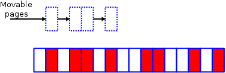
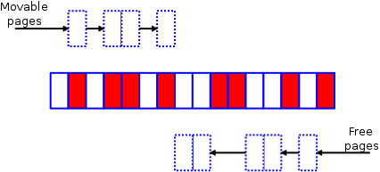

+++
title = "Memory Compaction"
outputs = ["Reveal"]
+++

# Memory Compaction

Dig down memory compaction subsystem

---

#### Memory Compaction v1

Figure 1: Imagine a very small memory zone which looks like this

---

#### Memory Compaction v1 (Cont.)

Figure 2: This code runs as two separate algorithms; the first of them starts at the bottom of the zone and builds a list of allocated pages which could be move

---

#### Memory Compaction v1 (Cont.)

Figure 3: at the top of the zone, the other half of the algorithm is creating a list of free pages which could be used as the target of page migration

---

#### Memory Compaction v1 (Cont.)

Figure 4: Eventually the two algorithms will meet somewhere toward the middle of the zone. 

---

#### Memory Compaction v1 (Cont.)

At that point, it's mostly just a matter of invoking the "page migration code" (which is not just for NUMA systems anymore) 

to shift the used pages to the free space at the top of the zone, yielding a pretty picture like this

---

#### Memory Compaction v1 (Cont.)

[Memory Compaction v1 patch](https://lwn.net/Articles/368854/)

[Memory Compaction First Article](https://lwn.net/Articles/368869/)