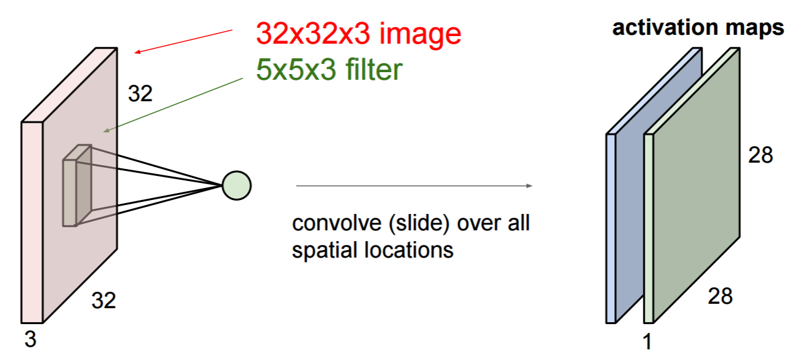
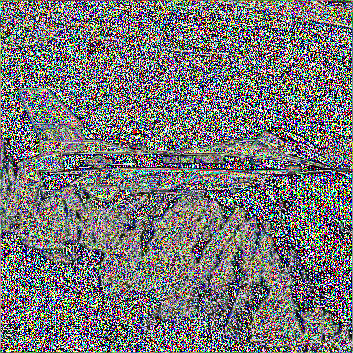
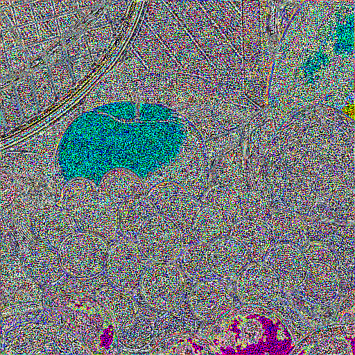
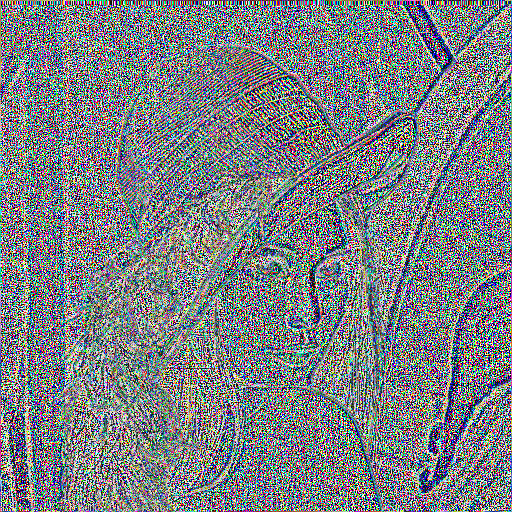

+++
title = "Many as One"
outputs = ["Reveal"]
weight = 10
+++

# Many as One

매니코어SW 지정과제 [순차처리 합성곱 필터 알고리즘](https://github.com/sshekh/conv-filters)을 [병렬처리 알고리즘](https://github.com/research-note/Many-as-One/tree/master/nn/conv-filters)으로 재구현 했습니다.

해당 모듈은 `여럿이 모여 하나` 프로젝트에 이미지 모듈에 추가하고 지속적 개선을 진행합니다.

---

#### Many as One (cont'd)

`여럿이 모여 하나`는 인공 신경망 코어 프레임워크를 구현합니다.

일반적인 `Python` 신경망 프레임워크 + `numpy` (GPU 컴퓨팅 + 싱글스레드 CPU와 UMA 기반)와 차이점이 있습니다.

---

#### Many as One (cont'd)

`여럿이 모여 하나`는 매니코어 병렬 처리에 대응하기위해

- C++17, C++20에서 추가하고 있는 TBB(Thread Building Blocks)기반의 표준을 활용합니다. 
- SYCL 표준 기반 텐서를 활용하여 GPU, FPGA 등을 활용한 범용 이기종 컴퓨팅이 가능합니다.


---

#### Many as One

- `여럿이 모여 하나`는 컨테이너 기반으로 네트워크 분산 처리를 구현합니다.
- Apche Arrow 포맷의 학습 데이터를 무한 확장 가능하여 빠른 처리와 지연시간을 최소화할 수 있습니다.


---

#### 이미지 합성곱 필터

- filter.hpp에서 편향을 가진 3차원 합성곱 커널을 구현합니다.
- 병렬 처리에 최적화한 벡터 기반 텐서를 할당 및 병렬 정규화 처리를 정의합니다.

---

### 이미지 합성곱 필터 (cont'd)

- conv2d\_layer.hpp에서 합성곱 레이어를 구현합니다. stride, zero-padding 등을 필터에 적용합니다.

---

### 이미지 합성곱 필터 (cont'd)

<p align="center">
    
</p>

- conv2d는 3-D data volume과 필터 벡터를 인자로 받습니다. 하나의 filter는 activation map을 생성합니다. 예를 들어 3 x 3 x 3 필터를 512px x 512px x 3 이미지에 적용하면 (1 stride, 1 zero padding) 512px x 512px 2-D 레이어를 출력합니다.

---


### 이미지 합성곱 필터

- 3개의 이미지에 대해서 배치작업을 실행하면 3개의 필터를 생성합니다. 현재 filter.txt 기반의 예제는 각각의 RGB 컬러 채널에 대해서 에지 디텍터 역할을 합니다.

---

### 반복자를 통한 병렬 실행 정책

- C++17, C++20의 표준 데이터 타입 컨테이너에 대한 반복자[std::execution](https://en.cppreference.com/w/cpp/header/execution)를 활용하여 병렬 실행을 활용합니다.
- 기존 C 언어 기반의 자료형을 모던 C++ 벡터 & 연산자 오버로딩으로 구현하였습니다.

---

## 행렬 단위 병렬 처리 공통화

- 행렬은 2차원 벡터를 이용합니다.
- 합성곱 모듈에서 `kernel` 처리에 활용합니다.

```cpp
template <typename F, typename T>
T trans_matrix(F f, T &m) {
    transform(std::execution::par,
        m.begin(), m.end(),
        m.begin(), [f](auto v) -> auto {
            return f(v);
        });
    return m;
}
```

---

## 텐서 단위 병렬 처리 공통화

- 텐서 단위의 병렬 처리는 3차원 벡터를 이용하고 병렬 실행 정책을 사용합니다.
- 합성곱 모듈에서는 `filter`, `conv2d` 처리에 활용합니다.

```cpp
template <typename F, typename T>
T trans_tensor(F f, T &t) {
    transform(std::execution::par, 
        t.begin(), t.end(),
        t.begin(), [f](auto m) -> auto {
            return trans_matrix(f, m);
        });

    return t;
}
```

---

## 이미지 처리 결과 (cont'd)

Input images               |  Output images
:-------------------------:|:-------------------------:
 | 

---

## 이미지 처리 결과 (cont'd)

Input images               |  Output images
:-------------------------:|:-------------------------:
 | 

---

## 이미지 처리 결과

Input images               |  Output images
:-------------------------:|:-------------------------:
 | 
